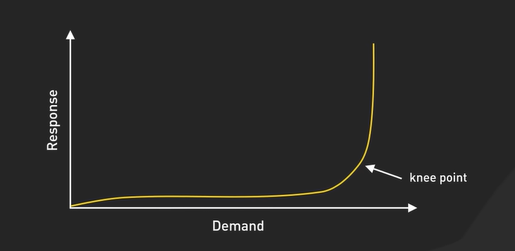

# Performance vs Scalability
## My final checklist

 What is performance?
 What is scalability?
 Can a system have good performance but poor scalability?
 Can a system scale but still have poor performance?
 What is vertical scaling?
 What is horizontal scaling?
 Why does horizontal scaling usually matter more for large distributed systems?
 What happens when you add a second server?
 What are potential bottlenecks besides the application server?
 Can you demonstrate performance degradation with a tiny API?
 Can you explain all of this without notes?

 ## What do we mean by a performant system ?
 Suppose we serve an article which is 16kb of data in 155 ms
 Increasing performance would mean
 - serving 20kb of data in 155ms
 - serving 16kb of data in 120ms
 - both

 Scalability would be the property which allows us to achieve the above with the addition of more resources without compromising performance. 
 Another way to look at performance vs scalability
 - If your system is slow for a single user - you have a performance problem
 - If your system is fast for a single user but slow under the load of multiple users - you have a scalability problem

 The core idea is Performance != Scalability, they are independent of each other. 
 No system is infinitely scalable, but we aim to push the knee of declining performance as far as possible

 

 How do you increase the performance ? 
 1. Use caching
 2. Asynchronism
 3. Understand Immutability as a default
 4. Lazy compute

 How do you make a system scalable
 1. Add more servers (horizontal scale)
 2. Add more RAMs (vertical scale)
 3. Write scalable code (DRY, Separation of concerns, etc)

 ## How to increase performance of your system
 1. Use Caching

 ### Cache the user sessions by storing them in a centralized persistent cache
 Why not on the application servers ? 
 - Seperation of concerns : appl. servers are best at processing requests, data storage (I/O ops) can be offloaded to someone which specializes in that field. Scaling also becomes easier
 - if appl. server goes offline user’s sessions will be lost. This would be mean cold-starting the server, out-putting degraded performance until the cache builds up. 
 - deployments won't be graceful
 - will have to use sticky sessions, i.e. dedicate a user to a particular server- This will cause servers to have uneven loads

### Never use File-Based Caching
What is file-based caching - store temporary data as files on a server's hard drive (or SSD). When an application needs the cached data, it reads it from these files.

Problems with File Based Caching : 

1. It Prevents Effective Auto-Scaling:  When you clone a server, you're just copying its base image (the operating system, the application code). You are **not** copying the cache files that were created *after* the server started running.
2.  It Creates "Cache Islands” :  In a load-balanced environment, a user's first request might go to Server A, which then creates a cache file for them. Their next request might go to Server B, which has no idea the cache exists on Server A.
3. It Complicates Server Management : When a server is terminated, it loses all the “warm” cache and its replacement starts “cold”. This results in degraded performance until cache builds up again.

### Few ways to cache data :
Didn't Understand this. 

1. Cached Database Queries : Issue is whenever the data changes, you need to cache the query again. And this becomes especially prevalent when queries become complex.

2. Cached Objects : In case of complex queries, just delete the complete object lol. 
Some ideas of objects to cache:    
- user sessions (never use the database!)
- fully rendered blog articles
- activity streams
- user<->friend relationships

3. Referential Transparency  : A function or component is referentially transparent if, for a given input, it **always returns the same output** and has no other side effects (like changing a global variable).  Think of a function `calculate_shipping_cost(cart_items)`. If this function *only* uses the `cart_items` to calculate the cost, it's referentially transparent. It will always give the same cost for the same cart. This makes it incredibly easy to cache—the input (`cart_items`) can be the cache key. If the function also secretly checks the current time to apply a "flash sale discount," it's no longer referentially transparent. Its output depends on an external, changing factor.

Aynchronism :  pre-computing of overall general data can extremely improve websites and web apps and makes them very scalable and performant. The frontend of your website sends a job onto a job queue and immediately signals back to the user: your job is in work, please continue to the browse the page. The job queue is constantly checked by a bunch of workers for new jobs. If there is a new job then the worker does the job and after some minutes sends a signal that the job was done. The frontend, which constantly checks for new “job is done” - signals, sees that the job was done and informs the user about it. 

Immutability as a default - Imaging you have a user profile cached on 10 different servers. Now any change in the profile detail will have to reflect 10 servers and any failed operation will result in inconsistent data. With an immutable approach, you would cache the brand new user object and any new requests will fetch this user data. The old ones can be safely ignored and hence discarded. This simplifies caching. 

Lazy compute - delaying a computation until the result is absolutely needed. For example lazy loading images. 

## How to make a system more scalable
To understand this you have to understand what are the main culprits of an "unscalable" system : 
1. Centralized components - like a single server handling all transactions. You can vertical scale the server but hardware has its own limitations
2. High latency operations - a data processing pipeline taking too long. You can throw 50 servers at the problem, unless you reduce the response time of the particular pipeline, your response time will not reduce, thus degrading performance and not making the server scalable. 

Now to the main question, how to make it more scalable
1. Increase statelessness - don't let servers hold onto client specific data during requests (like user sessions)
2. Loose coupling - use well-designed components that can operate independently, or with minimal dependencies on each other. This will allow you scale only the components in-need of scaling. 
3. Event-driver architecture for non-blocking operations. However, this increases challenges like error handling, debugging, data consistency. 

## Horizontal Scaling vs Vertical Scaling
Add more servers - horizontal scaling
Increase the size of your original server (CPU, RAMs) - vertical scaling

Vertical scaling when
- You prioritize simplicity 
- You prioritize consistency
- You have money
- low server maintanance

Disadvantages of vertical scaling
- Limited hardware capabilities. 
- Cost can skyrocket quickly - diminishing returns. 
- Low fault tolerance

Horizontal scaling when
- Increase fault tolerance
- cheaper at scale

Disadvantages of horizontal scaling
- More complex - need to handle complexity, network partitioning.

How do you decide on which one is appropriate for you ?
It depends you need to consider : 
1. Budget
2. Workload - if it is predicatable, go for vertical 
3. Performance sensitive business - horizontal scaling

### Why horizontal scaling usually matters more for a large distributed system ? 
1. Geographical sense - It doesn't make sense for your user to fetch data from US when he resides in SG. It would take more time and more network bandwidth. Better option (if it justifies your costs) would be operate a server in SG and serve data from there. 
2. Load - It would be unfair of you to expect that one server can do all the compute of the world. Offload the compute to other servers and keep all of them performant. 
3. Fault tolerance - If one server dies, you can rest assured that other servers can take its place and handle the load until you resurrect another server. 
4. Separation of concerns - Suppose you have a sale in US, you can scale up your servers and plan for the load for US specifically without worrying about other geo locations. 

What happens when you add a second server ? 
1. Load on the first server reduces - using load balancer
2. Data redundancy increases - now you have same data lieing on two server, hence you have to worry about data consistency across multiple servers 
3. Fault tolerance increases. If one goes down you can rest-assured that the first one can handle the load for sometime
4. You start storing user sessions in a centralized storage or else you will end up with sticky sessions

## How to Scale ? 
### Implement key components and strategies
1. Load Balancing
2. Caching
3. CDNs
4. Sharding
5. Avoid centralized components
6. Use design patterns like - fanout, pipes, filters
7. Increase observability - CPU usage, memory usage, network latency, response times, network throughput

Scalability is a ongoing process, never stops. 
